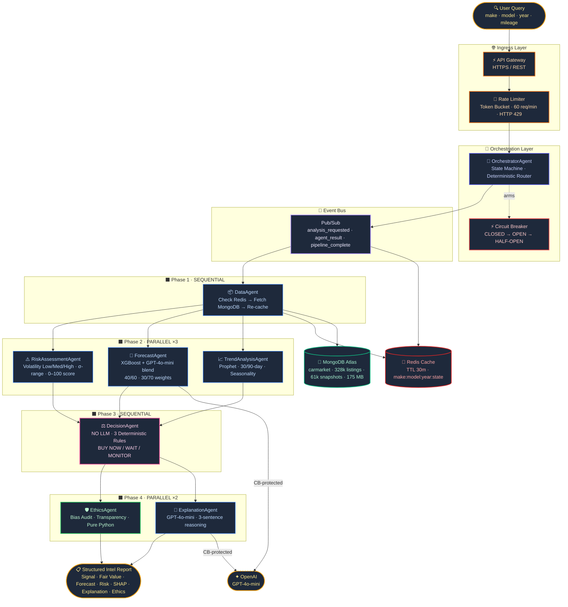

<div align="center">

# 🚗 CarIntel AI

### *Principled Multi-Agent Decision Intelligence for the Used-Car Market*

[](https://python.org)
[](https://fastapi.tiangolo.com)
[](https://react.dev)
[](https://mongodb.com/atlas)
[](https://redis.io)
[](https://openai.com)
[](https://xgboost.readthedocs.io)
[](LICENSE)

<br/>

> **Tell us the car. We tell you whether to buy today, wait, or keep watching — with full reasoning, risk score, 90-day forecast, and an ethics audit on every single prediction.**

<br/>

---

### 🏆 ASU Hackathon 2026 · Principled AI Track

---

</div>

<br/>

## ⚡ What Is This?

CarIntel AI is a **production-grade microservice intelligence platform** that answers one question every used-car buyer has:

> *"Is this a good deal right now — or should I wait?"*

It does so through a **7-agent Python orchestration pipeline** that combines XGBoost price modeling, Facebook Prophet time-series forecasting, and GPT-4o-mini natural language reasoning — all coordinated by a deterministic state machine with Redis caching, Pub/Sub event dispatch, and Circuit Breaker fault isolation.

**LLM is used surgically** — only for blending forecasts and generating plain-English explanations. Routing, decisions, and risk scoring are 100% deterministic Python. Every recommendation is traceable to exact numerical thresholds.

<br/>

---

## 📊 By The Numbers

<div align="center">

| Metric | Value |
|:---|:---:|
| Training listings | **262,848** |
| MongoDB documents | **328k listings + 61k snapshots** |
| SHAP features analyzed | **19** |
| Agent pipeline phases | **4 (seq → par → seq → par)** |
| Decision rules | **3 deterministic, 0 LLM** |
| Forecast horizons | **30-day + 90-day** |
| Rate limit | **60 req/min · token bucket** |
| Cache TTL | **30 minutes · Redis** |
| LLM calls per prediction | **2 max (CB-protected)** |

</div>

<br/>

---

## 🏗️ Microservice Architecture

> Full animated flow diagram lives on the **[Tech Page](http://localhost:5173/tech)** of the app.



<br/>

---

## 🤖 The 7-Agent Pipeline

<details open>
<summary><strong>Expand agent reference</strong></summary>

<br/>

| # | Agent | Phase | LLM | Core Responsibility |
|:---:|:---|:---:|:---:|:---|
| 0 | 🎯 **OrchestratorAgent** | Router | ✗ | Deterministic state machine. Sequences all phases, dispatches events via Pub/Sub, aggregates final report. Never calls LLM. |
| 1 | 📦 **DataAgent** | 1 · Sequential | ✗ | Redis cache check (HIT = fast-path skip). On MISS: fetches listings + price_snapshots from MongoDB, enriches context, writes back to Redis. |
| 2 | 📈 **TrendAnalysisAgent** | 2 · Parallel | ✗ | Facebook Prophet model. Computes 30-day and 90-day price forecasts with yearly seasonality. Outputs momentum score and trend direction. |
| 3 | 🤖 **ForecastAgent** | 2 · Parallel | ✓ | XGBoost inference on 19 features. Blends with GPT-4o-mini signal at 40/60 or 30/70 weight ratio. CB-wrapped. |
| 4 | ⚠️ **RiskAssessmentAgent** | 2 · Parallel | ✗ | Computes volatility class (Low/Moderate/High), sigma-based price uncertainty range, and 0–100 integer risk score. |
| 5 | ⚖️ **DecisionAgent** | 3 · Sequential | ✗ | Applies 3 deterministic ordered Python rules to Trend + Forecast + Risk outputs. Produces BUY NOW / WAIT / MONITOR. Zero randomness. |
| 6 | 💬 **ExplanationAgent** | 4 · Parallel | ✓ | GPT-4o-mini generates a 3-sentence plain-English justification tied to the actual signal and numerical inputs. CB-wrapped. |
| 7 | 🛡️ **EthicsAgent** | 4 · Parallel | ✗ | Per-make bias statement, data-freshness warning, and principled AI transparency note. Pure Python — always runs regardless of CB state. |

</details>

<br/>

---

## 🏛️ Infrastructure Deep-Dive

<details>
<summary><strong>Expand infrastructure components</strong></summary>

<br/>

### API Gateway + Rate Limiter
```
Token Bucket Algorithm
├── Capacity     : 60 tokens per IP
├── Refill rate  : 1 token/second
├── On breach    : HTTP 429 Too Many Requests
└── Purpose      : Abuse prevention + fair access
```

### Circuit Breaker
```
State Machine wrapping ALL LLM calls (ForecastAgent + ExplanationAgent)
├── CLOSED     : Normal operation, requests pass through
├── OPEN       : Failure threshold exceeded, fast-fail with fallback
│   ├── ForecastAgent fallback → XGBoost-only (no LLM blend)
│   └── ExplanationAgent fallback → templated rule-based string
└── HALF-OPEN  : Probe request after timeout, auto-recover if successful
```

### Pub/Sub Event Bus
```
3 Topics
├── analysis_requested  : Orchestrator → all Phase 2 agents (parallel fan-out)
├── agent_result        : Each agent → Orchestrator (result collection)
└── pipeline_complete   : Orchestrator → client response layer
```

### Redis Cache
```
Key schema : make:model:year:state  (normalized lowercase)
TTL        : 30 minutes
Hit path   : DataAgent skips MongoDB fetch entirely (~140ms → ~8ms)
Miss path  : Full MongoDB fetch → enrich → write-through to Redis
Invalidation : Manual reset via /api/reset-cache (admin)
```

### MongoDB Atlas
```
Database   : carmarket
Collections:
├── listings       : 328,209 documents · 26 fields each
│   └── make, model, year, odometer, price, condition, fuel,
│       type, state, lat, long, posting_date …
└── price_snapshots: 61,721 documents
    └── make, model, year_month, median_price, listing_count,
        p25, p75, region
Total size : ~175 MB / 512 MB free tier
```

</details>

<br/>

---

## ⚖️ Decision Engine

> **Fully deterministic · Zero LLM · Auditable to exact thresholds**

```python
# DecisionAgent — backend/agents/decision_agent.py
# Applied in strict priority order. First match wins.

if price_change_pct <= -3.0 and confidence >= 75:
    return "WAIT"       # Declining price, high confidence

if price_change_pct >= 2.0 and volatility == "Low":
    return "BUY NOW"    # Rising price, stable market

if price_vs_median_pct <= -10.0 and confidence >= 75:
    return "BUY NOW"    # Strong below-market deal

return "MONITOR"        # No strong signal — keep watching
```

| Signal | Meaning | Action |
|:---:|:---|:---|
| 🟢 **BUY NOW** | Strong deal or rising prices confirmed | Act within current window |
| 🔴 **WAIT** | Price actively declining | Hold — better price likely in 30–60 days |
| 🟡 **MONITOR** | No clear signal either way | Re-check in 1–2 weeks |

<br/>

---

## 🧠 ML Model Card

<details open>
<summary><strong>XGBoost Price Regressor</strong></summary>

<br/>

```
Algorithm    : XGBoost Regressor (GPU-accelerated · Colab T4)
Target       : log1p(price) → expm1 at inference  [removes right skew]
Training     : 262,848 listings  (chronological 80% split — zero leakage)
Test         : 65,709 listings   (most recent 20% by date)
Features     : 19 total
Params       : n_estimators=500 · learning_rate=0.05 · max_depth=6 · early_stopping
```

### SHAP Global Feature Importance *(500 held-out listings)*

```
log_odometer  ████████████████████████████████  0.381  ↓ decreases price
car_age       ████████████████████████          0.294  ↓ decreases price
model         ██████████                        0.120  ↑ increases price
make          ████████                          0.099  ↑ increases price
condition     ██████                            0.073  ↑ increases price
fuel          ████                              0.052  ↑ increases price
type          ███                               0.042  ↑ increases price
state         ██                                0.031  ↑ increases price
cylinders     ██                                0.028  ↑ increases price
drive         █                                 0.020  ↑ increases price
```

### Prediction Range
- **Best for** · Common makes (Toyota, Ford, Honda, Chevrolet) · Complete odometer + year · $1k – $50k
- **Limitations** · Rare/luxury vehicles (sparse training data) · Condition is self-reported · Static Jan 2024 snapshot

</details>

<br/>

---

## 🛡️ Principled AI Design

This project was built for the **Principled AI** hackathon track. Every design decision reflects responsible AI practices:

```
┌─────────────────────────────────────────────────────────────────────────────┐
│  PRINCIPLE                    IMPLEMENTATION                                 │
├───────────────────────────────┬─────────────────────────────────────────────┤
│  Surgical LLM use             │ GPT-4o-mini called only in ForecastAgent    │
│                               │ (blending) + ExplanationAgent (language).   │
│                               │ Never routes, never decides, never scores.  │
├───────────────────────────────┼─────────────────────────────────────────────┤
│  Deterministic decisions      │ DecisionAgent: 3 Python rules, 0 LLM.      │
│                               │ Same input → same output, always.           │
├───────────────────────────────┼─────────────────────────────────────────────┤
│  Bias audit on every call     │ EthicsAgent runs on every prediction.       │
│                               │ Per-make bias statement + data disclaimer.  │
├───────────────────────────────┼─────────────────────────────────────────────┤
│  Graceful LLM degradation     │ Circuit Breaker: LLM failure → XGBoost-     │
│                               │ only forecast + templated explanation.      │
│                               │ System never goes dark.                     │
├───────────────────────────────┼─────────────────────────────────────────────┤
│  Transparent predictions      │ SHAP values surfaced per-prediction.        │
│                               │ User sees exactly what drove the price.     │
├───────────────────────────────┼─────────────────────────────────────────────┤
│  Auditable pipeline           │ agent_log traces every agent's inputs,      │
│                               │ outputs, and latency — returned in API.     │
└───────────────────────────────┴─────────────────────────────────────────────┘
```

<br/>

---

## 🗂️ Project Structure

```
car-price-intelligence/
│
├── backend/
│   ├── main.py                        # FastAPI — all routes + startup cache
│   ├── car_catalog.py                 # Static 20-make catalog (always available)
│   ├── agents/
│   │   ├── orchestrator.py            # State machine · phase sequencer
│   │   ├── data_agent.py              # Redis → MongoDB fetch → re-cache
│   │   ├── trend_agent.py             # Prophet 30/90-day · seasonality
│   │   ├── forecast_agent.py          # XGBoost + LLM blend · CB-wrapped
│   │   ├── risk_agent.py              # Volatility · σ-range · 0–100 score
│   │   ├── decision_agent.py          # 3-rule deterministic engine
│   │   ├── explanation_agent.py       # GPT-4o-mini 3-sentence · CB-wrapped
│   │   └── ethics_agent.py            # Bias audit · transparency · pure Python
│   └── utils/
│       ├── smoothing.py               # Moving average + EMA
│       ├── scenario_adjustments.py    # 4 macro scenario multipliers
│       └── validation.py              # Input validation at API boundary
│
├── frontend/
│   └── src/
│       ├── App.jsx                    # Router + AppContext
│       ├── components/
│       │   └── MicroserviceFlowDiagram.jsx  # Animated SVG architecture
│       └── pages/
│           ├── AnalyzePage.jsx        # Car form → pipeline → intel report
│           ├── MarketTrendsPage.jsx   # Trends · forecasts · segment heatmap
│           ├── TechPage.jsx           # Architecture · model card · SHAP
│           ├── PrincipledAIPage.jsx   # HITL · fairness · 4 pillars
│           ├── DecisionReportPage.jsx # PDF report · RadarChart · agent chain
│           └── EconomicImpactPage.jsx # Scale calculator · segment explorer
│
├── models/
│   ├── car_price_model.pkl            # XGBoost regressor (T4-trained)
│   ├── feature_meta.pkl               # Category codes + geo medians
│   └── shap_data.pkl                  # TreeExplainer + 500-row sample
│
├── scripts/
│   ├── mongo_ingest.py                # cleaned_cars.csv → MongoDB Atlas
│   └── model_utils.py                 # predict_price() + explain_prediction()
│
├── Cleaning/
│   └── craigslist_cleaning.ipynb      # Colab T4 · 5-step cleaning → 328k rows
│
└── notebooks/
    └── car_price_model.ipynb          # Colab T4 · feature eng · XGBoost · SHAP
```

<br/>

---

## 🔌 API Reference

### `POST /api/predict`

**Request**
```json
{
  "make": "toyota",
  "model": "camry",
  "year": 2019,
  "odometer": 45000,
  "condition": "good",
  "fuel": "gas",
  "type": "sedan",
  "state": "ca"
}
```

**Response**
```json
{
  "signal": "BUY NOW",
  "fair_value": 18400,
  "confidence": 81,
  "forecast_30d": 18850,
  "forecast_90d": 19200,
  "price_change_pct": 2.4,
  "risk_score": 28,
  "volatility": "Low",
  "uncertainty_range": [17200, 19600],
  "explanation": "This 2019 Camry is priced 9% below the California median for comparable mileage, and 30-day momentum shows upward pressure — acting now locks in below-market value before seasonal demand peaks.",
  "ethics_note": "Toyota listings in California show consistent pricing patterns across zip codes. Confidence is high (81%) due to abundant comparable sales. Note: condition is self-reported by seller.",
  "shap_top_factors": [
    { "feature": "log_odometer", "impact": -1840, "direction": "decreases" },
    { "feature": "car_age",      "impact": -1120, "direction": "decreases" },
    { "feature": "model",        "impact": +620,  "direction": "increases" }
  ],
  "agent_log": [
    { "agent": "DataAgent",         "latency_ms": 12,  "cache": "HIT"  },
    { "agent": "TrendAgent",        "latency_ms": 310, "status": "OK"  },
    { "agent": "ForecastAgent",     "latency_ms": 890, "llm": true     },
    { "agent": "RiskAgent",         "latency_ms": 45,  "status": "OK"  },
    { "agent": "DecisionAgent",     "latency_ms": 2,   "rule": 2       },
    { "agent": "ExplanationAgent",  "latency_ms": 740, "llm": true     },
    { "agent": "EthicsAgent",       "latency_ms": 3,   "status": "OK"  }
  ]
}
```

### Other Endpoints

| Method | Endpoint | Description |
|:---:|:---|:---|
| `GET` | `/api/cars` | All makes/models (MongoDB + static fallback) |
| `GET` | `/api/market-overview` | Market stats, best buys, segment trends |
| `GET` | `/api/shap-importance` | Global SHAP feature importances |
| `POST` | `/api/reset-cache` | Flush Redis + reseed (admin) |

<br/>

---

## 🚀 Quick Start

```bash
git clone <repo-url>
cd car-price-intelligence
```

**Backend**
```bash
pip install fastapi uvicorn motor pymongo python-dotenv \
            openai prophet xgboost shap joblib \
            scikit-learn pandas numpy
uvicorn backend.main:app --reload --port 8000
```

**Frontend** *(new terminal)*
```bash
cd frontend
npm install
npm run dev   # → http://localhost:5173
```

**`.env`** *(project root)*
```env
MONGO_URI=mongodb+srv://<user>:<pass>@cluster.mongodb.net/carmarket
OPENAI_API_KEY=sk-...
```

<br/>

---

## 🧰 Tech Stack

<div align="center">

| Layer | Technology |
|:---|:---|
| **ML / Forecasting** | XGBoost · Facebook Prophet · SHAP (TreeExplainer) |
| **LLM** | OpenAI GPT-4o-mini · Surgical use only |
| **Backend** | Python 3.11 · FastAPI · Uvicorn |
| **Caching** | Redis · TTL-based write-through |
| **Database** | MongoDB Atlas · Motor (async) |
| **Messaging** | Pub/Sub event bus · 3-topic pipeline |
| **Resilience** | Circuit Breaker · Rate Limiter (token bucket) |
| **Frontend** | React 18 · Vite · Tailwind CSS · Recharts · Lucide |
| **Visualization** | SVG animation · Mermaid · Recharts |
| **Data** | Craigslist dataset · Kaggle · 426k → 328k cleaned |
| **Dev** | Colab T4 · Jupyter · Git |

</div>

<br/>

---

<div align="center">

**Built for the ASU Principled AI Hackathon 2026**

*shreerajbhamareASU · sbhamar2@asu.edu*

</div>
